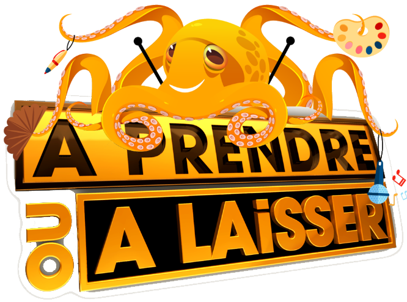

<!-- PROJECT LOGO -->
 

    

  <h3 align="center">Website PoulpyShow for the game APOAL</h3>

<!-- ABOUT THE PROJECT -->
## About The Project

APOAL has been made for the campaign of the art association at the ENSC (Ecole Nationale Superieure de Cognitique).
This website is the interface that gives the possibility to play the APOAL Game.

It is possible to : 
create a player account
Exchange a box with an other player
Access a list showing which players have which boxes.

### Built With

This website have been built in PHP and used a MySQL database
